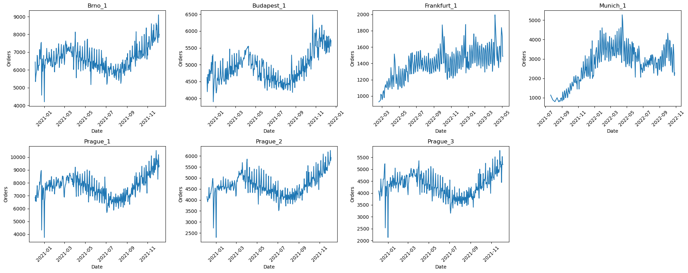
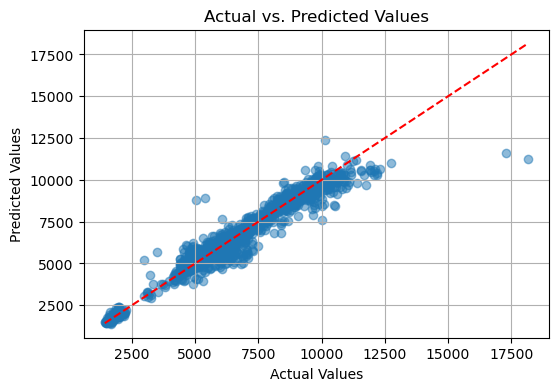
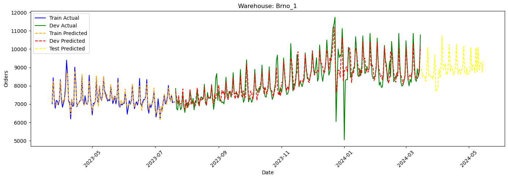

# Time Series Forecasting for Rohlik Group Orders

## Table of Contents

1. [Problem Definition](#problem-definition)
2. [Dataset Overview](#dataset-overview)
3. [Preprocessing and Feature Engineering](#preprocessing-and-feature-engineering)
4. [Model Training](#model-training)
5. [Future Orders Forecasting](#future-orders-forecasting)
6. [Acknowledgments](#acknowledgments)

## Problem Definition

Accurate order forecasting is critical for operational efficiency in e-grocery services, directly influencing workforce allocation, delivery logistics, inventory management, and supply chain optimization. By improving forecast accuracy, we can minimize waste, streamline operations, and contribute to a more sustainable business model.

This project, part of the Kaggle "Rohlik Orders Forecasting Challenge," aims to develop a time series forecasting model to predict future orders for the Rohlik Group, a leading e-grocery company. By optimizing our forecasting approach, Rohlik can enhance customer satisfaction and align with its sustainability mission.

## Dataset Overview

The dataset, available on [Kaggle](https://www.kaggle.com/competitions/rohlik-orders-forecasting-challenge/data), is provided by the Rohlik Group and includes data from seven warehouses, spanning multiple years. Each sample contains several features, including but not limited to:

- **Date**: The specific day of the recorded data.
- **Orders**: The number of orders (our target variable in the training set).
- **Warehouse**: The specific warehouse associated with the orders.
- **Holiday Name**: Whether a special holiday occurred on the specific date.

The dataset includes both training and test sets. While the training set contains the target variable (`orders`), the test set does not, and the goal is to forecast the number of orders for future dates based on the available historical data.

Below is a visual representation of the dataset across different warehouses:

    

The approach taken in this notebook leverages the time series nature of the data, focusing on real-life inspired forecasting models. While certain regression-based approaches may yield higher leaderboard scores on this particular Kaggle challenge, they may not always be applicable to real-world time series problems. Our approach focuses on a more interpretable, sequential prediction process.

## Preprocessing and Feature Engineering

To prepare the dataset for modeling, we applied several preprocessing steps:

- **Handling missing values**: The `holiday_name` column had missing values, which were filled with the string `'None'`.
- **One-hot encoding**: Categorical features such as `warehouse` and `holiday_name` were one-hot encoded.
- **Date Feature Extraction**: From the date column, several new features were created, such as:
  - `is_weekend`
  - `quarter`
  - `month`
  - `day_of_week`
- **Standard Scaling**: Numerical features were standardized using a `StandardScaler` to ensure all features have the same scale.
- **Lag Features**: For each sample, features from the preceding 14 days were added to better capture the time series patterns and provide context for predicting future values.

## Model Training

Various regression models were trained to forecast future orders, including:

- **XGBoost**
- **Random Forest**
- **CatBoost**

Each model was manually tuned for hyperparameters to optimize performance on the validation set. The models were evaluated using common time series forecasting metrics such as:

- **R² score** (coefficient of determination)
- **Mean Absolute Error (MAE)**
- **Mean Absolute Percentage Error (MAPE)**

Below is a plot showing the performance of the XGBoost model on the validation set. The closer the predicted values are to the actual values, the better the model’s performance:

    

## Future Orders Forecasting

Once the models were trained and validated, the best-performing model was selected for future orders forecasting.

- **Test Set Preprocessing**: The test data was preprocessed using the same techniques applied to the training set, including scaling and feature engineering.
- **Recursive Forecasting**: Since each future prediction relies on the previous 14 days of data, a recursive forecasting approach was used. This involves predicting the target value for the next day and using this prediction as part of the lagged features for subsequent days. This process continues until all the test data is predicted.

Below is a plot showcasing the forecast of the XGBoost model across different datasets:

    

## Acknowledgments

This project was part of the Kaggle "Rohlik Orders Forecasting Challenge," and all rights to the dataset are reserved by Rohlik Group and Kaggle.

### About the Author

- **Name**: Mena Ashraf Mikhael Saleh
- **Email**: [Mena.a.saleh.2001@gmail.com](mailto:Mena.a.saleh.2001@gmail.com)
- **GitHub**: [https://github.com/Mena-Saleh](https://github.com/Mena-Saleh)
- **LinkedIn**: [https://www.linkedin.com/in/mena-ashraf-23b947167/](https://www.linkedin.com/in/mena-ashraf-23b947167/)

I do not claim any form of ownership over the dataset used in this project.
